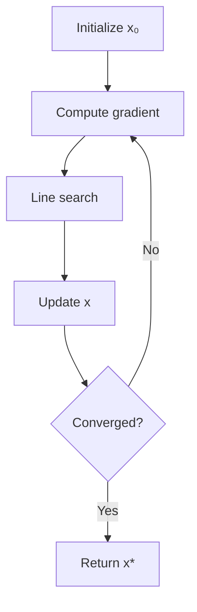

# 🚀 Complete Visualization Toolkit Guide

## Overview: Using All Three Extensions Together

You now have a **professional documentation toolkit** with three powerful extensions:

1. **Markdown Preview Enhanced** - Documents with math & inline plots
2. **Jupyter Notebooks** - Interactive analysis & experimentation  
3. **Draw.io** - Professional diagrams & flowcharts

## 🎯 The Optimal Workflow

### Use Case 1: **Learning & Understanding**

```
1. Read README.md → Theory with LaTeX equations
   ├─ Markdown Preview Enhanced renders math beautifully
   └─ Embedded Mermaid diagrams show algorithm flow

2. View Draw.io diagrams → Visual architecture
   ├─ Open .drawio files directly in VS Code
   └─ See high-level algorithm structure

3. Run Jupyter notebook → Interactive exploration
   ├─ Change parameters with sliders
   ├─ See immediate visual feedback
   └─ Experiment without breaking anything
```

### Use Case 2: **Research & Development**

```
1. Jupyter notebook → Rapid prototyping
   ├─ Test new algorithms
   ├─ Generate plots
   └─ Document results inline

2. Draw.io → Algorithm design
   ├─ Sketch out new ideas
   ├─ Compare approaches visually
   └─ Present to team

3. README.md → Final documentation
   ├─ Embed diagrams as images
   ├─ Link to notebooks for details
   └─ Mathematical proofs in LaTeX
```

### Use Case 3: **Teaching & Presentations**

```
1. Draw.io → Create slides/diagrams
   ├─ Export as PNG/SVG
   ├─ Professional quality
   └─ Easy to update

2. Jupyter → Live demos
   ├─ Interactive widgets
   ├─ Real-time parameter changes
   └─ Engage audience

3. README → Study materials
   ├─ Export to PDF (Markdown Preview Enhanced)
   ├─ Complete self-contained document
   └─ Share with students
```

## 📋 Quick Start Checklist

### Initial Setup

- [x] Markdown Preview Enhanced installed
- [x] Jupyter extension installed  
- [x] Draw.io extension installed
- [ ] Python packages: `pip install matplotlib numpy scipy ipywidgets`
- [ ] Configure Python path in Markdown Preview Enhanced settings

### Test Each Tool

**Test 1: Markdown Preview Enhanced**
```bash
# Open README.md
# Press Ctrl+K V (open preview)
# Check: Math equations render ✓
# Check: Mermaid diagram appears ✓
```

**Test 2: Jupyter Notebook**
```bash
# Open line_search_interactive.ipynb
# Click "Select Kernel" → Choose Python environment
# Run first cell (Shift+Enter)
# Check: Imports work ✓
```

**Test 3: Draw.io**
```bash
# Ctrl+Shift+P → "Draw.io: Create New Diagram"
# Draw a simple shape
# Save as test.drawio
# Check: Renders in editor ✓
```

## 🎨 Practical Examples

### Example 1: Document with Everything

**File: comprehensive_example.md**

```markdown
# My Optimization Algorithm

## Overview

Here's the high-level architecture:


## Mathematical Foundation

The algorithm minimizes:

$$
\min_{\mathbf{x}} f(\mathbf{x}) = \mathbf{x}^T Q \mathbf{x}
$$

## Algorithm Flow



## Interactive Demo

See [interactive notebook](./demo.ipynb) for:
- Parameter exploration
- Convergence analysis
- Performance comparison

## Implementation

\`\`\`python {cmd=true matplotlib=true}
import numpy as np
import matplotlib.pyplot as plt

x = np.linspace(0, 10, 100)
y = np.sin(x)

plt.plot(x, y)
plt.title('Example Plot')
plt.show()
\`\`\`
```

### Example 2: Interactive Analysis Notebook

**File: analysis.ipynb**

```python
# Cell 1: Setup
import numpy as np
import matplotlib.pyplot as plt
from ipywidgets import interact, FloatSlider

# Cell 2: Define function
def analyze(param1, param2):
    # Your analysis code
    fig, ax = plt.subplots(figsize=(10, 6))
    # ... plotting code ...
    plt.show()

# Cell 3: Interactive widget
interact(analyze,
    param1=FloatSlider(min=0, max=10, value=5),
    param2=FloatSlider(min=0, max=1, value=0.5)
)
```

### Example 3: Professional Diagram

**Steps in Draw.io:**

1. Create new diagram
2. Add shapes:
   - Start/End: Rounded rectangle (green)
   - Process: Rectangle (blue)
   - Decision: Diamond (orange)
3. Connect with arrows
4. Add labels
5. Export as PNG/SVG
6. Embed in markdown

## 🔧 Advanced Techniques

### 1. Linking Everything Together

**In README.md:**
```markdown
## Algorithm Details


For detailed analysis, see:
- [Interactive Demo](./interactive.ipynb) - Parameter exploration
- [Implementation](./algorithm.py) - Production code
- [Tests](./test_algorithm.py) - Unit tests
```

**In Jupyter Notebook:**
```python
# Display diagram
from IPython.display import Image
Image('./diagrams/algorithm.png')

# Link to README
from IPython.display import Markdown
Markdown('[Back to documentation](./README.md)')
```

### 2. Automated Diagram Export

**Create export script:**
```python
# export_diagrams.py
import subprocess
import os

diagrams = [
    'line_search_architecture',
    'backtracking_flowchart',
    'wolfe_conditions'
]

for diag in diagrams:
    # Draw.io CLI export
    subprocess.run([
        'drawio',
        '--export',
        '--format', 'png',
        '--output', f'./diagrams/{diag}.png',
        f'./diagrams/{diag}.drawio'
    ])

print("All diagrams exported!")
```

### 3. Notebook to Documentation

**Convert notebook to markdown:**
```bash
jupyter nbconvert --to markdown line_search_interactive.ipynb
```

**Then embed in main README!**

## 💡 Pro Tips & Tricks

### Markdown Preview Enhanced

1. **Right-click menu:**
   - "Run Code Chunk" - Execute Python blocks
   - "Open in Browser" - Full-screen preview
   - "Export" → PDF/HTML - Share documents

2. **Front matter for styling:**
```markdown
---
title: "Line Search Methods"
author: "Your Name"
date: 2025-10-18
---
```

3. **Import other files:**
```markdown
@import "./code/algorithm.py" {class="line-numbers"}
```

### Jupyter Notebooks

1. **Magic commands:**
```python
%matplotlib inline  # Inline plots
%load_ext autoreload  # Auto-reload modules
%autoreload 2
```

2. **Hide code cells:**
```python
# Add this cell at top
from IPython.display import HTML
HTML('''<style>
.input {display: none !important;}
</style>''')
```

3. **Interactive widgets:**
```python
import ipywidgets as widgets
slider = widgets.FloatSlider(value=0.5)
display(slider)
```

### Draw.io

1. **Keyboard shortcuts:**
   - `Ctrl+D` - Duplicate selection
   - `Alt+Shift+Arrow` - Connect shapes
   - `Ctrl+G` - Group shapes

2. **Style templates:**
   - Save frequently used styles
   - Create reusable shape libraries
   - Use layers for complex diagrams

3. **Collaboration:**
   - .drawio files are XML (git-friendly)
   - Export to multiple formats simultaneously
   - Use comments for annotations

## 🎓 Learning Path

### Beginner

**Week 1-2: Basic Setup**
- ✅ Install all extensions
- ✅ Test each tool individually
- ✅ Create simple examples

**Week 3-4: Integration**
- ✅ Create combined document
- ✅ Link notebook to markdown
- ✅ Export to different formats

### Intermediate

**Month 2: Advanced Features**
- Interactive widgets in notebooks
- Complex mermaid/PlantUML diagrams
- Custom CSS styling in markdown

**Month 3: Automation**
- Scripts to export diagrams
- Automated notebook execution
- CI/CD for documentation

### Advanced

**Month 4+: Professional Workflow**
- Documentation-driven development
- Literate programming style
- Complete project templates

## 🐛 Troubleshooting Guide

### Issue: Python code doesn't execute in markdown

**Solution:**
1. Check Python path: Settings → Markdown Preview Enhanced → Python Path
2. Install packages: `pip install matplotlib numpy`
3. Try "Run All Code Chunks" from preview right-click menu

### Issue: Jupyter kernel won't start

**Solution:**
1. Select kernel: Top right → "Select Kernel"
2. Install ipykernel: `pip install ipykernel`
3. Register kernel: `python -m ipykernel install --user`

### Issue: Draw.io export fails

**Solution:**
1. Export manually: File → Export as → PNG
2. Check file permissions
3. Use Draw.io desktop app if needed

### Issue: Math doesn't render

**Solution:**
1. Use Markdown Preview Enhanced (not built-in preview)
2. Check syntax: `$$...$$` for display, `$...$` for inline
3. Try refreshing preview

## 📦 Complete Setup Script

Save this as `setup.sh`:

```bash
#!/bin/bash

echo "Setting up complete visualization toolkit..."

# Install Python packages
pip install matplotlib numpy scipy ipywidgets jupyter

# Create directory structure
mkdir -p diagrams
mkdir -p notebooks
mkdir -p docs

# Create example files
cat > test_markdown.md << 'EOF'
# Test Document

## Math
$$f(x) = x^2$$

## Diagram
\`\`\`mermaid
graph LR
    A --> B
\`\`\`

## Plot
\`\`\`python {cmd=true matplotlib=true}
import matplotlib.pyplot as plt
import numpy as np
x = np.linspace(0, 10, 100)
plt.plot(x, np.sin(x))
plt.show()
\`\`\`
EOF

echo "✅ Setup complete!"
echo "Next steps:"
echo "1. Open test_markdown.md"
echo "2. Press Ctrl+K V to preview"
echo "3. Check that everything works!"
```

## 🌟 Best Practices

1. **Organize by purpose:**
   - `/docs` - Markdown documentation
   - `/notebooks` - Jupyter analysis
   - `/diagrams` - Draw.io sources

2. **Version control:**
   - Commit .drawio files (they're XML)
   - Consider `.gitignore` for large outputs
   - Keep notebook outputs in git (for GitHub preview)

3. **Naming conventions:**
   - `README.md` - Main entry point
   - `*_interactive.ipynb` - Interactive notebooks
   - `*_analysis.ipynb` - Data analysis notebooks
   - `*.drawio` - Editable diagrams
   - `*.png` - Exported images

4. **Documentation flow:**
   - README → Overview with theory
   - Diagrams → Visual architecture
   - Notebooks → Interactive details
   - Code → Production implementation

## 🎉 You're Ready!

You now have a **professional-grade documentation and analysis toolkit**!

**What you can do:**
✅ Write mathematical documentation with LaTeX  
✅ Create interactive plots and analyses  
✅ Design professional diagrams  
✅ Combine everything seamlessly  
✅ Export to multiple formats  
✅ Share and collaborate effectively  

**Explore the examples:**
- `README.md` - See all features in action
- `line_search_interactive.ipynb` - Interactive demo
- `diagrams/` - Professional diagrams

**Happy documenting! 📚✨**
