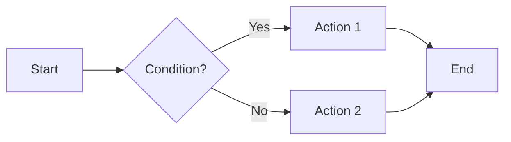

# Visualization Guide for Line Search README

This guide explains how to enable interactive plots and diagrams in your markdown documentation.

## 🎨 What's Already Enabled

Your README now includes:

1. **Mermaid Diagrams** - Flowcharts showing algorithm logic
2. **Python Code Blocks with Matplotlib** - Interactive plots
3. **ASCII Diagrams** - Simple text-based visualizations

## 📦 Required Extensions

You already have **Markdown Preview Enhanced** installed, which supports all of this!

## 🚀 How to Enable Plot Rendering

### Method 1: Configure Python for Code Execution (Recommended)

1. **Configure Python Path** in Markdown Preview Enhanced:
   - Open VS Code settings (`Ctrl+,`)
   - Search for "Markdown Preview Enhanced"
   - Find "Python Path" setting
   - Set it to your Python executable path

2. **Install Required Packages**:
   ```bash
   pip install matplotlib numpy
   ```

3. **Enable Code Execution**:
   - Right-click in the preview
   - Select "Run Code Chunk" or "Run All Code Chunks"
   - Or click the "Run" button that appears above code blocks

### Method 2: Alternative Visualization Extensions

If you want even more visualization power, consider these additional extensions:

```vscode-extensions
hediet.vscode-drawio,ms-python.python,ms-toolsai.jupyter
```

#### **Draw.io Integration** (`hediet.vscode-drawio`)
- Create professional diagrams directly in VS Code
- Export as SVG/PNG and embed in markdown
- Great for complex architecture diagrams

#### **Jupyter Extension** (`ms-toolsai.jupyter`)
- Create `.ipynb` notebooks with interactive plots
- Link to notebooks from your README
- Best for complex visualizations

#### **Python Extension** (`ms-python.python`)
- Syntax highlighting for Python code blocks
- IntelliSense in code blocks
- Better integration with Markdown Preview Enhanced

## 🎯 What Each Visualization Shows

### 1. Mermaid Flowchart
Shows the logical flow of line search algorithms:
- Decision points (Armijo check, Wolfe check)
- Loop structure (shrinking α)
- Clear algorithm logic

**How to view**: Should render automatically in preview!

### 2. φ(α) Function Plot
Shows:
- The merit function φ(α) curve
- Armijo condition line
- Exact minimum vs backtracking acceptance
- Acceptable region visualization

**How to run**: Click "Run" button above the code block in preview

### 3. Convergence Plot
Shows:
- 2D optimization path on contour plot
- Function value decrease over iterations
- Visual proof of convergence

**How to run**: Click "Run" button above the code block in preview

## 🔧 Troubleshooting

### Code Blocks Don't Execute

**Problem**: Python code blocks show code but don't generate plots

**Solutions**:
1. Check Python path in settings
2. Install matplotlib: `pip install matplotlib numpy`
3. Right-click in preview → "Markdown Preview Enhanced: Open in Browser"
4. Try running code chunks manually

### Mermaid Diagrams Don't Render

**Problem**: Mermaid blocks show as plain text

**Solutions**:
1. Ensure you're using Markdown Preview Enhanced (not built-in preview)
2. Update the extension to latest version
3. Check if mermaid is enabled in extension settings

### Plots Render but Look Bad

**Solutions**:
1. Adjust figure size in code: `plt.figure(figsize=(10, 6))`
2. Use `plt.tight_layout()` to prevent label cutoff
3. Export to browser for better rendering: Right-click → "Open in Browser"

## 💡 Creating Your Own Plots

### Template for Matplotlib Plots

```python {cmd=true matplotlib=true}
import numpy as np
import matplotlib.pyplot as plt

# Your code here
x = np.linspace(0, 10, 100)
y = np.sin(x)

plt.figure(figsize=(10, 6))
plt.plot(x, y, label='sin(x)')
plt.xlabel('x')
plt.ylabel('y')
plt.title('My Plot')
plt.legend()
plt.grid(True, alpha=0.3)
plt.tight_layout()
plt.show()
```

**Key attributes**:
- `{cmd=true}` - Tells MPE to execute the code
- `matplotlib=true` - Tells MPE to expect matplotlib output

### Template for Mermaid Diagrams



**Mermaid types**:
- `graph TD` - Top-down flowchart
- `graph LR` - Left-right flowchart
- `sequenceDiagram` - Sequence diagram
- `gantt` - Gantt chart
- `classDiagram` - Class diagram

## 🌟 Advanced: Interactive Plots with Plotly

For even more interactive plots, you can use Plotly:

```python {cmd=true}
import plotly.graph_objects as go
import numpy as np

x = np.linspace(0, 10, 100)
y = np.sin(x)

fig = go.Figure(data=go.Scatter(x=x, y=y, mode='lines'))
fig.update_layout(title='Interactive Plotly Plot')
fig.show()
```

**Note**: Requires `pip install plotly`

## 📊 Best Practices

1. **Keep plots simple** - Focus on one concept per plot
2. **Use annotations** - Label important points
3. **Consistent style** - Use same colors/fonts across plots
4. **Export for sharing** - Right-click → Export → PDF/HTML
5. **Alt text** - Add descriptions for accessibility

## 🔗 Resources

- [Markdown Preview Enhanced Docs](https://shd101wyy.github.io/markdown-preview-enhanced/)
- [Mermaid Syntax](https://mermaid-js.github.io/mermaid/)
- [Matplotlib Gallery](https://matplotlib.org/stable/gallery/index.html)

## 📝 Quick Start Checklist

- [ ] Markdown Preview Enhanced installed
- [ ] Python configured in settings
- [ ] matplotlib and numpy installed (`pip install matplotlib numpy`)
- [ ] Preview opened (`Ctrl+Shift+P` → "Markdown Preview Enhanced: Open Preview")
- [ ] Code execution enabled (click "Run" buttons)
- [ ] Mermaid diagrams rendering
- [ ] Plots generating successfully

Happy visualizing! 🎉
