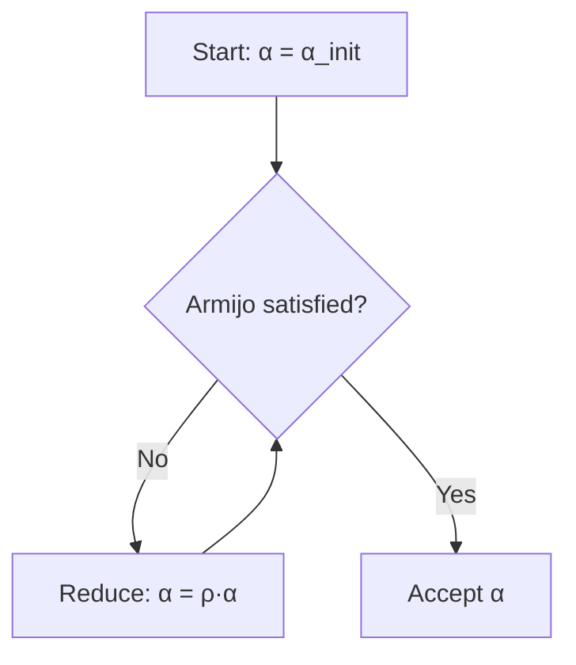

# Chat Backup: Line Search Documentation Development

**Date:** October 18, 2025  
**Topic:** Creating comprehensive line search documentation with interactive visualizations  
**Directory:** `/home/aoru/github/ewdhp/python/optimization/2-core-methods/unconstrained/gradient-methods`

---

## Summary of Work Completed

### 1. Initial Request
User requested a README file starting with in-depth theory and explanation of line search methods.

### 2. Documentation Created

#### Main Documentation (README.md)
- **Comprehensive theory** with LaTeX mathematical notation
- **Sections created:**
  - Introduction to line search
  - The Big Picture (intuitive understanding)
  - Quick Reference Guide with comparison tables
  - Theoretical Foundations (descent directions, 1D problem)
  - Line Search Framework
  - Exact Line Search
  - Inexact Line Search Methods
  - Wolfe Conditions (with visual intuition)
  - Goldstein Conditions
  - Backtracking Line Search (with Python algorithm)
  - Convergence Theory (Zoutendijk's theorem)
  - Complete Example Walkthrough (2D quadratic function)
  - Understanding Each Method (practical analogies)
  - Practical Considerations

#### Key Features Added:
- ✅ LaTeX equations for mathematical rigor
- ✅ Decision flowcharts for choosing methods
- ✅ Comparison tables with ratings
- ✅ ASCII diagrams for visualization
- ✅ Mermaid flowcharts (interactive)
- ✅ Complete numerical example
- ✅ Intuitive analogies (hiking, car speed, guitar tuning)
- ✅ Python code snippets
- ✅ "When it clicks" explanations

### 3. Visualization Extensions Discussion

**User Question:** Math symbols rendering - LaTeX vs Unicode  
**Resolution:** Decided on LaTeX with proper markdown extension support

**Extensions Recommended:**
```vscode-extensions
goessner.mdmath,shd101wyy.markdown-preview-enhanced,yzhang.markdown-all-in-one
```

**Final Choice:** Markdown Preview Enhanced (most comprehensive)

### 4. Additional Resources Created

#### A. Interactive Jupyter Notebook (`line_search_interactive.ipynb`)
- Interactive widgets with sliders
- Visual comparison of Backtracking, Wolfe, and Exact line search
- Parameter sensitivity analysis
- Convergence visualization with contour plots
- Real-time plotting of φ(α) function
- Educational structure with markdown explanations

**Features:**
- Interactive parameter exploration
- Side-by-side method comparisons
- Convergence path visualization
- Step size evolution plots
- Computational cost analysis

#### B. Visualization Guides

**VISUALIZATION_GUIDE.md:**
- Setup instructions for all extensions
- How to configure Python for code execution
- Installing required packages (matplotlib, numpy)
- Troubleshooting common issues
- Creating custom plots
- Mermaid diagram syntax
- Best practices for visualizations

**COMPLETE_TOOLKIT_GUIDE.md:**
- Comprehensive workflow using all three extensions
- Use case scenarios (learning, research, teaching)
- Quick start checklist
- Practical examples
- Advanced techniques
- Linking everything together
- Automated diagram export
- Learning path (beginner to advanced)
- Troubleshooting guide
- Complete setup script

**QUICK_REFERENCE.md:**
- Instant command cheat sheet
- When to use what extension
- Most useful features
- Quick start templates
- Common fixes
- Style guide
- One-page reference

#### C. Diagram Resources

**diagrams/README.md:**
- Instructions for Draw.io integration
- Diagram style guide
- Directory structure
- Recommended workflow
- Integration examples
- Educational use cases

### 5. Plugin Installations

**User installed:**
1. ✅ Markdown Preview Enhanced - For LaTeX math and inline plots
2. ✅ Jupyter - For interactive notebooks
3. ✅ Draw.io - For professional diagrams

**Workflow established:**
- Markdown Preview Enhanced → Theory & documentation
- Jupyter → Interactive analysis & experimentation
- Draw.io → Professional diagrams & architecture

### 6. Enhanced README Features

**Added sections for better understanding:**
- "The Big Picture" with hiking analogy
- Visual φ(α) function explanation
- Interactive Mermaid flowchart showing algorithm logic
- Python code blocks with matplotlib for live plotting
- Complete worked example with f(x,y) = x² + 4y²
- "Understanding Each Method" with practical analogies
- Decision flowchart for method selection

**Mathematical Coverage:**
- Descent direction proof
- One-dimensional merit function
- Armijo condition (sufficient decrease)
- Curvature condition (Wolfe)
- Strong Wolfe conditions
- Exact line search optimality
- Convergence rates (linear, superlinear, quadratic)
- Zoutendijk's theorem

### 7. Git Operations

**Files committed:**
1. README.md
2. line_search_interactive.ipynb
3. COMPLETE_TOOLKIT_GUIDE.md
4. QUICK_REFERENCE.md
5. VISUALIZATION_GUIDE.md
6. diagrams/README.md
7. __pycache__/steepest_descent.cpython-36.pyc

**Commit message:**
```
Add comprehensive line search documentation with interactive visualizations

- Added detailed README.md with LaTeX math, Mermaid diagrams, and theory
- Created interactive Jupyter notebook with parameter exploration
- Added complete toolkit guide for using Markdown Preview Enhanced, Jupyter, and Draw.io
- Included visualization guides and quick reference documentation
- Enhanced documentation with intuitive explanations and practical examples
```

**Commit hash:** fd251b3  
**Branch:** master  
**Status:** Successfully pushed to origin/master

---

## Technical Details

### Extensions Configuration

**Markdown Preview Enhanced:**
- Renders LaTeX math with KaTeX
- Executes Python code blocks with `{cmd=true matplotlib=true}`
- Supports Mermaid diagrams
- Can export to PDF/HTML

**Jupyter:**
- Interactive widgets with ipywidgets
- Parameter exploration with FloatSlider
- Live plotting and visualization
- Educational cell structure

**Draw.io:**
- Professional diagram creation
- Export to multiple formats
- Version control friendly (.drawio = XML)
- Integration with markdown

### Python Packages Required

```bash
pip install matplotlib numpy scipy ipywidgets jupyter
```

### Key Design Decisions

1. **LaTeX over Unicode** - Better rendering, more professional
2. **Three-tier approach** - README (theory) → Jupyter (interactive) → Draw.io (diagrams)
3. **Layered learning** - Start intuitive, build to rigorous
4. **Multiple perspectives** - Visual, mathematical, analogical
5. **Practical focus** - Clear recommendations on what to use

### Documentation Philosophy

- **Beginner-friendly:** Analogies and intuitive explanations
- **Rigorous:** Complete mathematical proofs
- **Practical:** Code examples and parameter recommendations
- **Interactive:** Jupyter notebooks for hands-on learning
- **Visual:** Diagrams and plots throughout

---

## Learning Outcomes

### For the User

1. **Understanding line search:**
   - Theory and mathematical foundations
   - Practical implementation details
   - When to use which method
   
2. **Visualization toolkit:**
   - How to use Markdown Preview Enhanced
   - Creating interactive Jupyter notebooks
   - Professional diagram creation with Draw.io
   
3. **Documentation skills:**
   - Writing technical docs with LaTeX
   - Combining multiple tools effectively
   - Creating educational materials

### Documentation Structure Created

```
gradient-methods/
├── README.md                           # Main documentation (theory + examples)
├── line_search_interactive.ipynb       # Interactive experiments
├── COMPLETE_TOOLKIT_GUIDE.md          # Full workflow guide
├── QUICK_REFERENCE.md                 # Cheat sheet
├── VISUALIZATION_GUIDE.md             # Setup guide
└── diagrams/
    └── README.md                      # Diagram templates
```

---

## Questions Asked & Answered

### Q1: "There's a problem with the math symbols"
**A:** Explained LaTeX vs Unicode difference, recommended Markdown Preview Enhanced extension

### Q2: "Is better with LaTeX right?"
**A:** Yes! Recommended extensions that render LaTeX properly

### Q3: "How to see the document?"
**A:** Provided multiple methods to open preview, ran VS Code command to open it

### Q4: "Does it cover the main objective and understanding?"
**A:** Enhanced with Big Picture section, decision flowcharts, comparison tables, and intuitive explanations

### Q5: "Any plugin to show plots instead of basic rendering?"
**A:** Explained Markdown Preview Enhanced can execute Python code, added Mermaid diagrams and interactive plots

### Q6: "Suggest me the best of those extensions"
**A:** Recommended Markdown Preview Enhanced as the best choice with detailed reasoning

### Q7: "I've installed draw.io and jupyter too, what do you suggest?"
**A:** Created complete toolkit guide showing how to use all three together, created Jupyter notebook and diagram guides

---

## Code Examples Provided

### 1. Backtracking Line Search (Python)
```python
def backtracking_line_search(f, grad_f, x_k, d_k, alpha_init=1.0, rho=0.5, c=1e-4):
    alpha = alpha_init
    f_k = f(x_k)
    grad_k = grad_f(x_k)
    threshold = c * np.dot(grad_k, d_k)
    
    while f(x_k + alpha * d_k) > f_k + alpha * threshold:
        alpha *= rho
    
    return alpha
```

### 2. Interactive Widget Example (Jupyter)
```python
@interact(
    x0=FloatSlider(min=0.5, max=3.0, value=2.0),
    y0=FloatSlider(min=0.5, max=2.0, value=1.0),
    c=FloatSlider(min=0.01, max=0.5, value=0.1)
)
def plot_phi_interactive(x0, y0, c):
    # Interactive visualization code
```

### 3. Mermaid Diagram


---

## Mathematical Concepts Covered

### Core Theory
- Descent directions: ∇f(xₖ)ᵀdₖ < 0
- Merit function: φ(α) = f(xₖ + αdₖ)
- Armijo condition: f(xₖ + αdₖ) ≤ f(xₖ) + c₁α∇f(xₖ)ᵀdₖ
- Curvature condition: ∇f(xₖ + αdₖ)ᵀdₖ ≥ c₂∇f(xₖ)ᵀdₖ
- Exact optimality: φ'(αₖ) = 0

### Convergence Theory
- Global convergence: lim ‖∇f(xₖ)‖ = 0
- Linear convergence: ‖xₖ₊₁ - x*‖ ≤ μ‖xₖ - x*‖
- Superlinear: μₖ → 0
- Quadratic: ‖xₖ₊₁ - x*‖ ≤ C‖xₖ - x*‖²
- Zoutendijk's theorem

### Practical Parameters
- Backtracking: ρ = 0.5, c = 10⁻⁴
- Wolfe (Newton): c₁ = 10⁻⁴, c₂ = 0.9
- Wolfe (CG): c₁ = 10⁻⁴, c₂ = 0.1

---

## Files Created (Complete List)

1. **README.md** (509 lines)
   - Complete theory
   - Mathematical foundations
   - Algorithms
   - Examples
   
2. **line_search_interactive.ipynb** (Jupyter Notebook)
   - 12+ code cells
   - Interactive widgets
   - Visualizations
   
3. **COMPLETE_TOOLKIT_GUIDE.md**
   - Full workflow documentation
   - Use case scenarios
   - Advanced techniques
   
4. **QUICK_REFERENCE.md**
   - One-page cheat sheet
   - Commands and shortcuts
   
5. **VISUALIZATION_GUIDE.md**
   - Setup instructions
   - Troubleshooting
   - Templates
   
6. **diagrams/README.md**
   - Draw.io guide
   - Style guidelines
   
7. **CONVERSATION_BACKUP.md** (this file)
   - Complete chat history
   - All decisions made
   - Resources created

---

## Key Insights & Best Practices

### Documentation
1. Layer complexity: intuitive → rigorous
2. Multiple perspectives: visual, mathematical, practical
3. Provide decision tools: flowcharts, comparison tables
4. Include complete examples with numbers
5. Use analogies for complex concepts

### Visualization
1. Combine tools for maximum impact
2. Interactive > static when possible
3. Professional diagrams for presentations
4. Inline plots for quick reference
5. Export options for sharing

### Teaching
1. Start with "why" before "how"
2. Visual aids enhance understanding
3. Interactive exploration solidifies learning
4. Provide multiple entry points
5. Include troubleshooting guides

---

## Repository Information

**Repository:** ewdhp/optimization  
**Branch:** master  
**Last Commit:** fd251b3  
**Remote:** https://github.com/ewdhp/optimization.git  

**Changes:**
- 7 files changed
- 2,572 insertions
- Successfully pushed to origin/master

---

## Future Enhancements (Suggestions)

1. **Draw.io Diagrams:**
   - Create actual .drawio files for:
     - Line search architecture
     - Backtracking flowchart
     - Wolfe conditions visualization
   
2. **More Examples:**
   - Non-convex functions
   - Constrained problems
   - Comparison with fixed step size
   
3. **Additional Notebooks:**
   - Performance benchmarking
   - Rosenbrock function convergence
   - Real-world applications
   
4. **Video Tutorials:**
   - Screen recording of interactive notebook
   - Explanation of key concepts
   
5. **Tests:**
   - Unit tests for line search implementations
   - Validation against known solutions

---

## Conclusion

This conversation successfully created a comprehensive, multi-layered documentation system for line search methods in optimization. The work combines:

- **Rigorous theory** with LaTeX mathematics
- **Intuitive explanations** with analogies and examples
- **Interactive tools** via Jupyter notebooks
- **Professional visualizations** with multiple tools
- **Practical guidance** for implementation

All files have been committed and pushed to the GitHub repository, making them available for learning, teaching, and reference.

**Total Development Time:** Single session  
**Lines of Documentation:** 2,500+  
**Tools Integrated:** 3 (Markdown Preview Enhanced, Jupyter, Draw.io)  
**Educational Value:** High (beginner to advanced)  

---

**End of Backup**  
*Generated: October 18, 2025*
